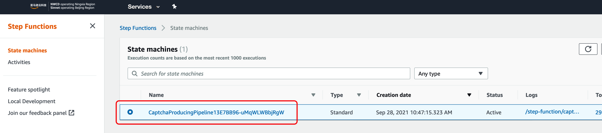
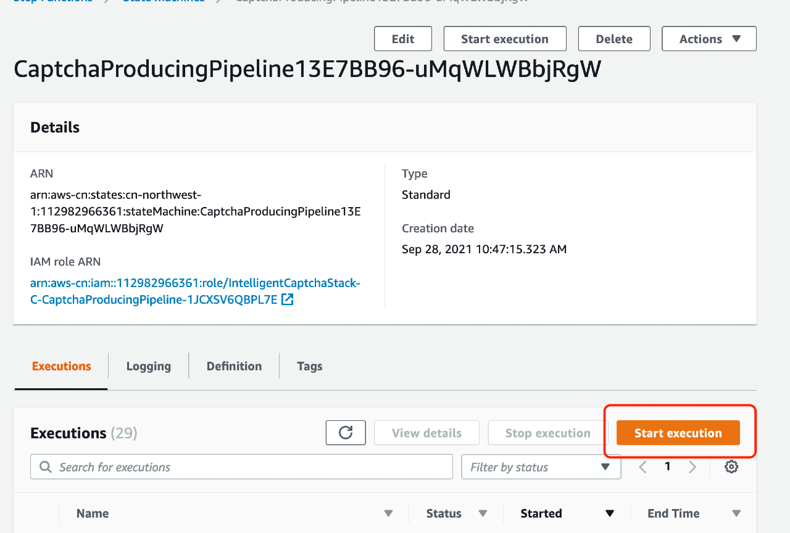
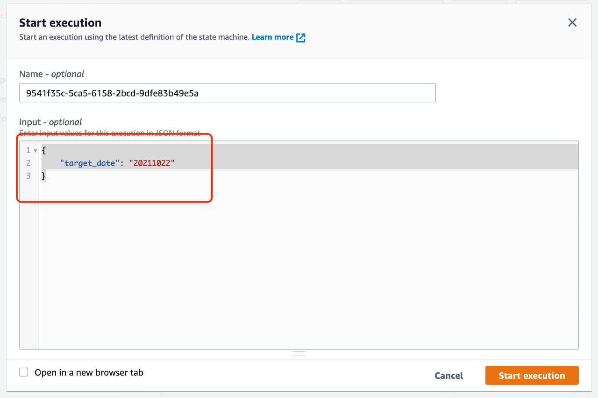

# aws-gcr-solutions-intelligent-captcha

##Overview
This solution contains two part, online part to serve the http request to get the capcha image url and corrisponding result through the api gateway and lambda function, offline part is a step-function workflow to use a daily fargate task to generate customized number of captcha images in s3 and save the captcha image url and result in dynamoDB.

##Architecture


##Main features
1. generate specified number of captchas daily, the number of captcha images can be specified in cloudformation parameter.
2. serverless architecture to provide captcha api, the captcha images are saved in s3 and url and result value is saved in DynamoDB.
3. user can rerun the captcha generation workflow and specify the target date, if user does not specify the captcha target date, workflow will use next day to generate the captcha.
4. The captcha image are simple Math calulation problems but transfered to Chinese charactors. Also the Chinese characters are all adding Machine learning generated noise to adding difficulty for Bot program to identify the charactors. Also we are adding some random lines in the captcha images to adding the chaotics.

##Example response
```angular2html
{
  "captchaUrl": {
    "S": "https://captcha-generator-buckets-596963228260-us-east-1-prod.s3.us-east-1.amazonaws.com/2021/10/25/-2547890308052297360_35a877c7e2c2a87b13ee8dfbbc7f00c3.png"
  },
  "captcha_date": {
    "S": "20211025"
  },
  "ExpirationTime": {
    "N": "1635754613"
  },
  "result": {
    "S": "970"
  },
  "captcha_index": {
    "N": "96"
  }
}
```

##Captcha image example


The result of this captcha should be 200 which can be calculated by (100 + 50) + 50 = 200

##Supported parameters when deploy
| Parameter Name| Description | Default Value |
|----------|----------|----------|
| MaxDailyCaptchaNumber | Number of Captcha images generate daily | 100 |
| MaxCaptchaKeepDays | Number of days to keep the captcha images, the dynamoDB and S3 captcha files will be deleted after the specified days which will save cost | 7 |
| deployStage | the name of the deployment stage('dev','beta','gamma','preprod','prod'), this parameter is created to support deploy multiple env in same aws account | "prod" |
| notifyEmail | the email address which will be notified by sns about the captcha generating result, eg: testing@amazon.com | "" |
| captchaGenerateHour | enter the hour of day in UTC to start generating captcha images daily, from 0 to 23, default is 8 which is 16:00 of Beijing time | 8 |

## How to use?
### Prerequest
This solution request VPC to run, if user want to deploy this solution to existing VPC, please use "-c vpcId=vpc-VPCIDXXXXX" in cdk deploy command to specify  VPC id, if not specify VPC, the deployment process will try to create a new VPC.

###How to deploy
First use "aws configure" to update the aws credentials then type following commands
```shell
$ cd source
$ npm i
$ npx cdk synthesize
$ npx cdk deploy --parameters MaxDailyCaptchaNumber=1000 -c vpcId=vpc-VPCIDXXXXX --parameters notifyEmail=xxxxx@email.com
```


## How to cdk synth/diff/deploy?

```shell
$ npm run synth
$ npm run diff
$ npm run deploy
$ npm run deploy -- --parameters Param1=Value1 --parameters Param2=Value2
```

## How to format your code?

```shell
$ npm run eslint
```

## How to release?

```shell
$ # https://github.com/conventional-changelog/standard-version#release-as-a-target-type-imperatively-npm-version-like
$ npm run bump -- --release-as minor # major, minor or patch
$ # or
$ npm run bump -- --release-as 1.1.0
$ # dryrun
$ npm run bump -- --dry-run --release-as 1.1.0
$ # push tag to remote
$ git push origin v1.1.0
```

## How to manually trigger the captcha generating workflow
1. Login to the aws step-function console.
2. Find the captcha generating workflow, for example:
   
3. Click the "Start execution" Button, for example:
   
4. Replace the Input with following content, change the value of "target_date" to specified date
```json
{
    "target_date": "20211022"
}
```
   
